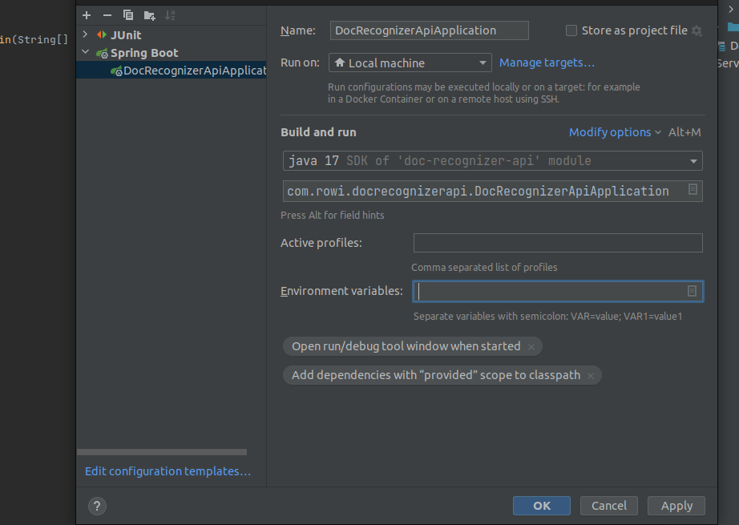
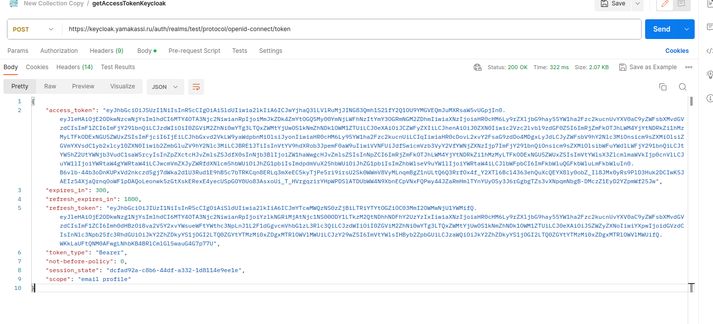
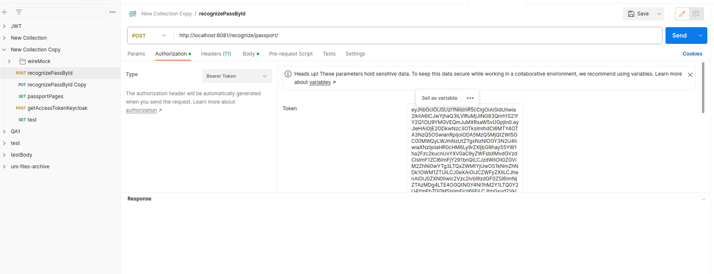
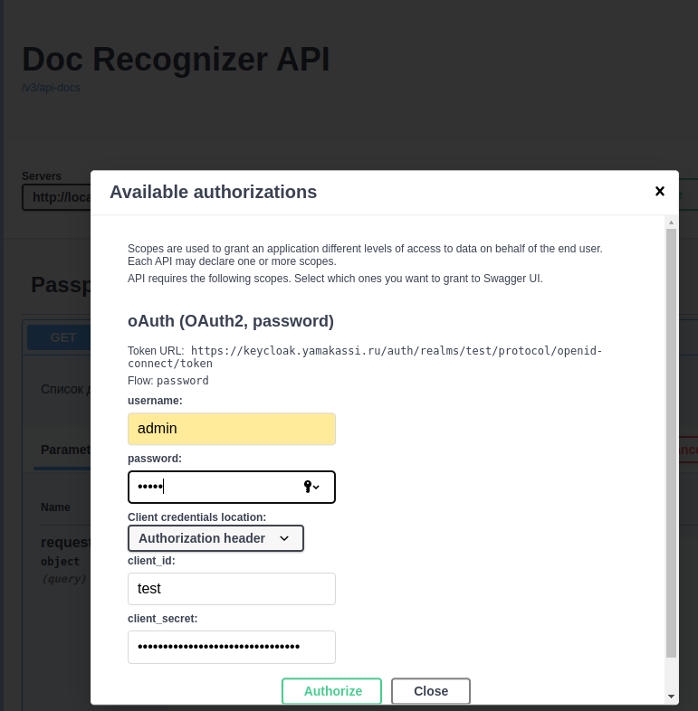
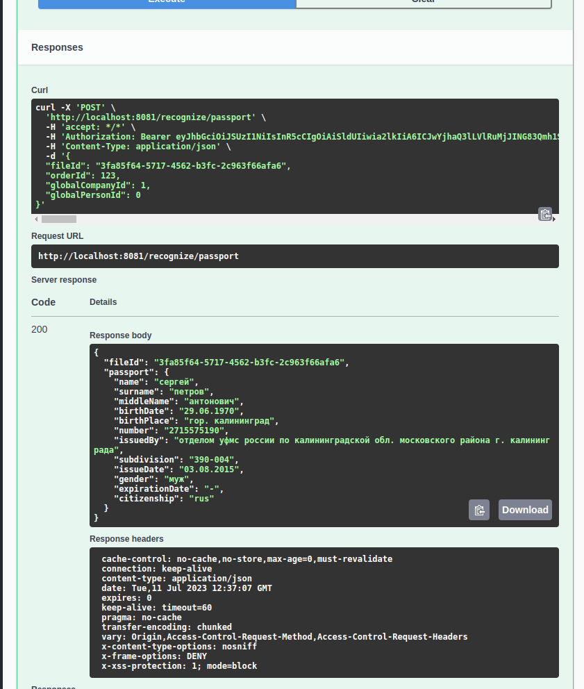

# doc-recognize-api
# сервис по распознаванию
Для запуска приложения нужно указать в переменных среды данные от яндекс api
 > YANDEX_TOKEN_API=<токен>;YANDEX_FOLDER_ID=<id каталга>
> 

# Запросы 
- запросы можно проверить из постмана (коллекция лежит  в папке проекта - src/main/resources)
  - 1 . Для обращения к ендпоинтам следует выполнить запрос к keycloak на получение access токена
  
  - 2 .  Далее полученный токен вставляем во вкладке authorization   и делаем запрос
  
  - 3 . Аналогично и с остальными методами 
- запросы из swagger-ui (доступно по http://localhost:8081/swagger-ui/index.html)
    - авторизация пользователя для запросов

      
    - выполнение запроса
  
      
